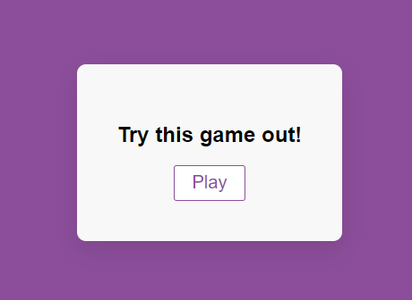
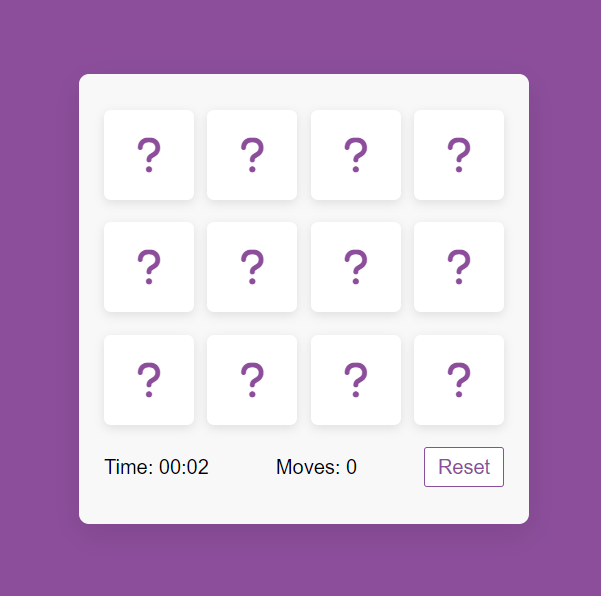
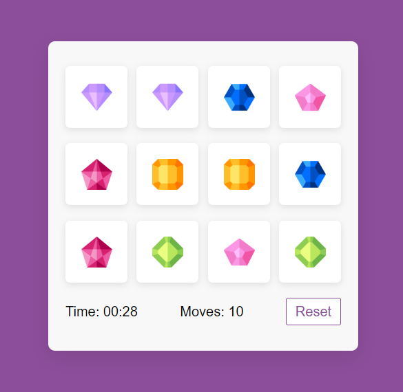

### Memory Card Game

After starting the game the Start section is hidden and the game body appears.

After the game is started the timer is automatically counting as well after every try the moves are counted and displayed.

Finally when every card is flipped by clicking **Reset** the timer starts over again from zero, the count moves are zero and the cards are shuffled and flipped so the game can be played again.

